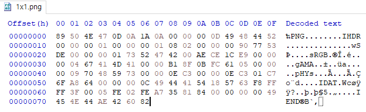

# PNG File Signatures
{: .no_toc }

PNG 파일 시그니처

## contents
{: .no_toc .text-delta }

1. TOC
{:toc}

---

## PNG 파일 시그니처(File Signatures)
크기가 1x1 픽셀인 png 파일을 만들어 png 파일의 파일 시그니처를 확인한다.



{: .note-title }
> PNG 파일 시그니처
>
> Header Signature(Hex, 8Bytes) : 
> 89 50 4E 47 0D 0A 1A 0A        (89 50 4E -> PNG )
>
> Footer Signature(Hex, 8Bytes) : 
> 49 45 4E 44 AE 42 60 82

그러면 다음과 같이 8bytes로 구성된 헤더와 푸터의 시그니처를 확인할 수 있다.

## CHUNK
png 파일은 파일 시그니처 이외에도 다양한 청크들의 집합으로 구성되어 있다.
이때, 청크는 공통된 데이터들의 집합을 의미한다.

png 파일은 `IHDR`, `sRGB`, `gAMA`, `pHYs`, `IDAT`, `IEND`의 청크를 가지고 있다.
이 중에서 `IHDR`, `IDAT`, `IEND`는 반드시 포함되어야 하는 청크이다.

청크의 구조는 다음과 같다.
```markdown
{
    Length (4 bytes),
    Chunk Type (4 bytes),
    Chunk Data (length bytes),
    CRC (4bytes)
}
```
- `Length`는 Chunk의 크기
- `Chunk Type`은 Chunk의 타입, `IHDR`, `IDAT` 등
- `Chunk Data`는 Chunk의 내용(실제 데이터가 들어간다), 가변 길이를 가짐
- `CRC`는 순환중복검사, 데이터의 오류 검사를 위한 값

### IHDR CHUNK

```markdown
{
    Length : 00 00 00 0D (13 bytes),
    Chunk Type : IHDR,
    Chunk Data (13 bytes),
    {
        Width (4 bytes),
        Height (4 bytes),
        Bit depth (1 byte),
        Color type (1 byte),
        Compression method (1 byte),
        Filter method (1 byte),
        Interlace method (1 byte),
    }
    CRC (4 bytes)
}
```
- `Width`와 `Height`는 이미지의 가로, 세로를 의미하며 각각 4bytes씩 차지한다.
- `Bit depth`는 한 픽셀이 차지하는 비트의 양을 의미한다.
- `Color type`은 색의 유형을 나타낸 것이다.

